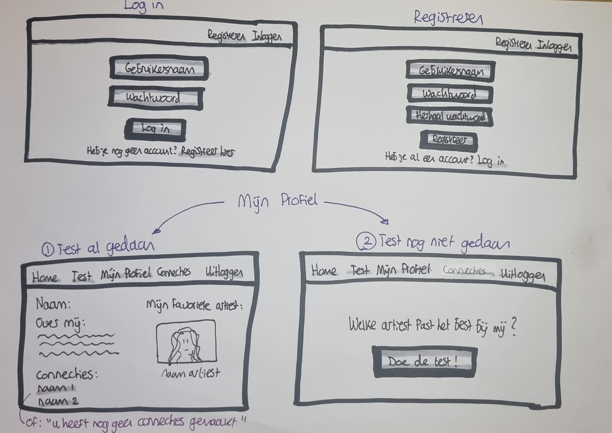
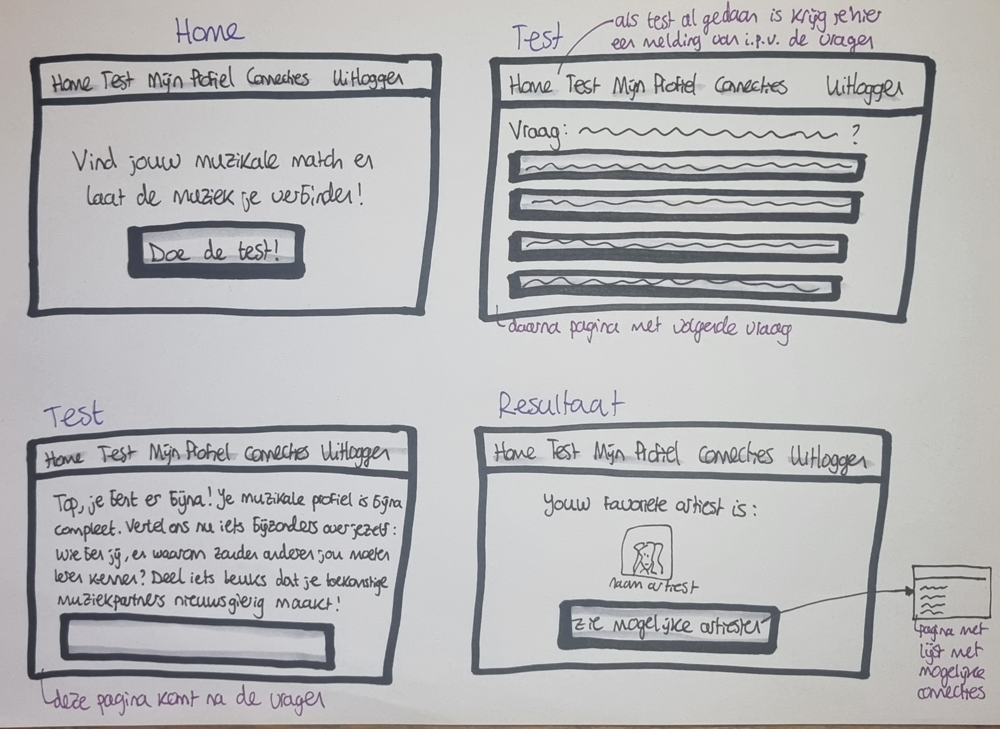

# **Projectnaam**: Muzikale Match
# **Naam**: Sophie Kaandorp

## Vragen
1. Het probleem dat mijn project gaat oplossen, is de uitdaging om mensen te vinden die dezelfde muzieksmaak hebben als jij. Muzieksmaak is erg persoonlijk en kan veel over iemand vertellen. Het kan moeilijk zijn om mensen te vinden die dezelfde muziek of artiesten leuk vinden. Het kan bijvoorbeeld zijn dat jij fan bent van Adele, maar niemand in je omgeving is fan van haar. Via deze webpagina kun je mensen vinden die wel fan van haar zijn. Dit project biedt een kans om mensen te vinden met dezelfde muzikale interesses en om te connecten met deze personen 
2. Mijn project is gericht op muziekliefhebbers van alle leeftijden die op zoek zijn naar mensen met vergelijkbare muzikale interesses.
3. Mijn project wordt gemaakt als webpagina (voor op de computer).
4. Mijn project richt zich specifiek op het matchen van mensen met dezelfde muzieksmaak. Veel andere platforms richten zich op andere interesses. Dit maakt mijn project uniek. 

## Schets

## Features
### Vereist:
1. Registreren, inloggen en uitloggen.
2. Een test met 5 vragen over muziek. Hierna volgt een korte vraag over jezelf (om je profiel compleet te maken).
3. Het creëren van een profiel. Hierin staat welke artiest het beste bij jou past en een korte beschrijving van jezelf. Andere gebruikers kunnen jouw profiel zien.
4. Een lijst met namen van mogelijke connecties (mensen die dezelfde favoriete artiest hebben als jij).

### Volgende doelen:
1. De mogelijkheid om op connecties te klikken en profielen te bekijken.
2. De mogelijkheid om een muziektrack aan je profiel toe te voegen (met de keuze uit drie nummers van jouw favoriete artiest).
3. De mogelijkheid om nummers te raten tijdens de test (waardoor jouw favoriete artiest ook op basis van deze ratings wordt bepaald).
4. De mogelijkheid om je profiel te wijzigen.
5. De mogelijkheid om profielen van connecties te liken.
6. De mogelijkheid om berichten te sturen naar connecties.
7. Percentages toevoegen aan de profielen, met een indicatie van hoeveel je met die persoon matcht op basis van de antwoorden.

## Requirements:
**Spotify Embeds API**: Mogelijk te gebruiken als ik ervoor kies om muziektracks toe te voegen aan mijn pagina.

**Sqlalchemy**: Gebruikt om gebruikersgegevens op te slaan in een database en om deze gegevens later aan te kunnen passen.

**HTML/CSS**: Voor de opmaak.

## Wat wordt moeilijk?
Het matchen op basis van muzieksmaak kan een uitdaging zijn. Als ik weinig en duidelijke vragen gebruik, blijft het overzichtelijk. Maar als ik meer vragen toevoeg of muziektracks met ratings implementeer, wordt het al snel complexer.